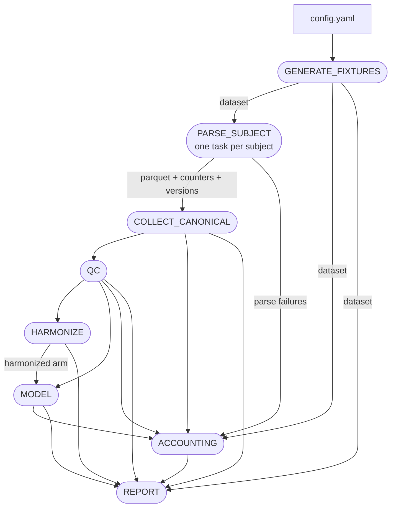

# morphline

**A BIDS-aware longitudinal neuroimaging derivatives pipeline.** It ingests FreeSurfer `.stats` output, accounts for every observation it gains and loses, quality-controls it, harmonizes across scanners, fits longitudinal mixed-effects models, and emits a self-contained HTML report you could reconstruct the entire run from.

[](https://github.com/mattglittenberg/morphline/actions/workflows/ci.yml)
[](https://www.python.org/downloads/)
[](LICENSE)

> **Status:** ingestion, accounting, QC, harmonization, and the longitudinal model are all implemented and validated. The model fits the full 28-test region set with primary and secondary FDR families corrected separately, a harmonized-vs-unharmonized sensitivity arm, and slope recovery bounded against injected truth. Release engineering is in progress; `v0.1.0` is the current tag.

---

## Quickstart

No data required — the pipeline generates its own fixtures.

```bash
uv sync
uv run morphline run --config config/test.yaml --outdir results/
open results/report.html
```

Or through Nextflow, which is how it runs in CI:

```bash
nextflow run . -profile test,docker --outdir results/
```

`-profile local` needs no container at all and runs the same DAG against your virtualenv.

---

## The pipeline



The config channel feeds every process and is omitted above for legibility. The generated DAG, execution trace, and Nextflow's own report are committed in [docs/pipeline_info/](docs/pipeline_info/) from a real CI run — refreshed whenever the workflow shape changes, because a diagram that disagrees with `main.nf` is worse than none.

**Two orchestration paths, one set of stages.** `morphline run` executes everything in one process; each stage is also its own CLI subcommand reading and writing paths, which is what Nextflow invokes. [tests/test_nextflow_parity.py](tests/test_nextflow_parity.py) drives the staged CLI in the DAG's order and asserts the artifacts match the in-process run.

**Channels carry file paths, never dataframes.** Each process writes Parquet and emits its path; gathering steps `collect()` paths and the consumer reads them with pyarrow inside its own container. That costs nothing at this scale and means the architecture doesn't need rewriting if the dataset grows by two orders of magnitude.

---

## Why synthetic fixtures are the primary substrate

Development runs against a synthetic stats-file generator, not real data. This is not a compromise — it is the stronger engineering position:

- It forces the ingestion boundary to be a real interface rather than an accident.
- It makes CI possible at all: a cold clone runs the full pipeline with zero external data and zero data-use agreements.
- **It permits statistical validation that real data cannot support.** Real data has no known true slope, so "did the model recover the effect?" is unanswerable. The generator injects known site effects, age effects, diagnosis effects, and a known diagnosis × time interaction, then the test suite asks whether each stage recovers them.

**Two validation dimensions, deliberately kept separate:**

| Dimension | Question | Substrate | Verdict |
|---|---|---|---|
| Statistical recovery | Do the methods recover known truth? | Synthetic fixtures | Numeric tolerances, pass/fail in CI |
| Real-data integration | Does it handle real files and real metadata? | ABIDE I (cross-sectional) | Accounting checks and sanity criteria |

Synthetic recovery cannot prove the parser handles real headers. Real-data integration cannot prove the model recovers a true slope. Both are needed, and they answer different questions.

## Results the test suite asserts

Every number here is computed by the test suite and bounded by an assertion, not a claim in prose. The suite runs in CI on every push.

**Longitudinal slope recovery** — 28 regions fit on a clean regime-A fixture (90 subjects × 4 sessions): all 28 of the 95% intervals contain the injected slope, worst-case relative error **10.3%** against a declared 20% bound, median **3.1%**, mean signed error **−0.6%** against a 5% bound on systematic bias. Two guards keep it non-vacuous — the injected effect must exceed 3 standard errors, and a deliberate 10% scaling of every estimate fails all three criteria.

**ComBat harmonization** — γ recovery *r* = **0.998** with worst-case error 7.6% of the true effect spread; site R² falls **0.62 → 0.0001**; longitudinal slopes unchanged to within **1%**.

**QC sensitivity and specificity** — on planted cases, treating FAIL+WARNING as flagged: recall **1.00** (896 true positives, 0 false negatives), false-positive rate **0.001** (4 of 4144 clean), precision **0.996**. Metrics are reported separately for the FAIL-only and FAIL+WARNING operating points, since a three-level status model has two. Recall alone is not a criterion: flagging everything achieves recall 1.0.

**Real-data integration** — the full ABIDE PCP run over all 1112 subjects: **3314 files parsed with zero failures, 30,910 canonical observations**, and a funnel reconciling with zero unexplained loss, including the 9 known-incomplete subjects attributed by reason code rather than quietly absent.

**External cross-check** — morphline's per-subject numbers, aggregated, against FreeSurfer's own `asegstats2table`/`aparcstats2table` output produced by a third party: **all 28,976 shared observations match, maximum absolute difference 0.0.** This is the only *external* validation of the ingested numbers; everything else compares morphline against morphline, or against truth morphline generated.

## Data accounting

Every boundary reports what it gained and lost, and every drop has a stated cause:

```
raw files → parsed files → canonical observations → QC-passing observations → modeled observations
```

`morphline account` and `morphline run` **exit non-zero when the funnel does not reconcile.** Unexplained loss is a bug, not a rounding error. Parse failures never escape as exceptions; they become reason-coded records. Loss counters are measured exactly at ingestion and never derived as a remainder — a catch-all would make the funnel reconcile by construction, which looks like an answer while being one.

The modeling boundary is decomposed rather than labelled: a scope decision (`outside_modeled_region_set`) and a data limitation that biases the remaining sample (`incomplete_model_covariates`) have opposite implications for a reader, so they are never collapsed into one number.

## Architecture

Parsing and entity resolution are separate concerns, and the separation is load-bearing:

```
stats files
    ↓
FreeSurferStatsParser          knows aseg/aparc structure ONLY
    ↓                          knows nothing about datasets, sites, or BIDS
parsed FreeSurfer records
    ↓
DatasetAdapter                 knows subject/session conventions, site,
    ↓                          scanner, demographics, dataset layout
canonical observations (Parquet)
    ↓
accounting → QC → harmonization → modeling → report
```

**Architectural rule: everything downstream of ingestion reads only the canonical schema.** QC, harmonization, modeling, and reporting never import the parser, never touch a `.stats` file, and never contain a FreeSurfer-specific string. Adding a dataset requires writing an adapter and nothing else.

That rule is enforced by [tests/test_architecture_boundary.py](tests/test_architecture_boundary.py), which walks the AST of every stage module — including a meta-test that the check itself can still fail. A docstring asking nicely does not survive a deadline; a failing test does.

---

## The statistical model

```python
value ~ age_baseline + time + dx_baseline + time:dx_baseline + sex + etiv_baseline
# random: intercept + slope on time, grouped by subject_id
```

The `age_baseline` / `time` split is the point of the parameterization: it separates the cross-sectional age gradient, which is confounded with cohort effects, from the within-subject rate of change, which is what a longitudinal design is for. Age-at-session and time are collinear by construction and never appear together.

`etiv_baseline` and `dx_baseline` are fixed at baseline deliberately. Within-subject eTIV should be roughly constant, so a time-varying version mostly injects measurement error into the slope; and time-varying diagnosis is a post-baseline variable caused partly by the process being modeled, so conditioning on it invites collider bias.

**Head-size adjustment is mandatory.** Regional volumes without it is the most common error in this literature.

### Region set: 14 structures, 28 tests

Subcortical: hippocampus, amygdala, thalamus, caudate, putamen, lateral ventricle, inferior lateral ventricle.
Cortical: entorhinal, parahippocampal, inferior parietal, precuneus, posterior cingulate, middle temporal, superior frontal.

Bilateral, so **14 structures is 28 regional tests.** Hemispheres are independent tests and count in the multiplicity family; regions and tests are reported separately, because stating the wrong one understates your own correction burden. This is a hypothesis-driven default rather than a fallback — whole-brain (~113 structures) is available behind a flag with its own FDR family.

### Multiplicity: the family is declared, not implied

- **Primary family:** the `time:dx_baseline` coefficient across the 28 regional tests. Benjamini–Hochberg FDR is applied within this family and only this family.
- **Secondary families:** the main effects of `time`, `dx_baseline`, and `age_baseline` each form their *own* family, corrected separately, never pooled with the primary or with each other, and labelled exploratory.
- Raw *p* and *q* are reported for every test in every family, and each family's size is stated numerically in the report.

---

## Honest scope

Written before the work, kept accurate as it lands.

### The limitation to notice first

**The longitudinal path is validated against synthetic ground truth, not real longitudinal data.** Public longitudinal *and* multi-scanner MRI with redistributable FreeSurfer derivatives barely exists. OASIS-3 is the obvious candidate and requires institutional registration this project does not have.

**This is a searched-for gap, not an assumed one.** [scripts/audit_openneuro.py](scripts/audit_openneuro.py) audited OpenNeuro exhaustively: **1859 datasets examined, index exhausted; 414 with ≥2 declared sessions; 51 shipping FreeSurfer `.stats` at all; exactly one with multi-session stats** — and that one has 8 usable subjects. The best candidate, Penn LEAD, is genuinely longitudinal (73 of 132 subjects have ≥2 sessions) but its public FreeSurfer derivatives are one session-collapsed run per subject. Full evidence in [docs/openneuro_audit.md](docs/openneuro_audit.md).

The generalizable lesson, which cost an afternoon: **an accession can ship complete FreeSurfer derivatives and still not be longitudinal**, because the pipeline that produced them collapsed sessions. No filename search detects that.

### Scanner effects are not identifiable from confounded data

Standard ComBat assumes independent observations, which longitudinal data violates. The deeper problem is that **scanner is frequently confounded with time** — subjects scanned on an older scanner early in a study and a newer one later. When that confounding is strong, **the biological longitudinal effect and the scanner effect are not identifiable from the observed data alone.** No harmonization method recovers a unique answer from confounded data; the separation rests on assumptions the data cannot check. This is a property of the study design, not a deficiency in the software.

It follows that **running harmonized and unharmonized models is a sensitivity analysis, not a solution.** It shows how conclusions depend on the harmonization assumption; it does not establish which is correct. The report labels these results as sensitivity analysis in those words, reports the scanner × time crosstab and a quantitative confounding measure, and marks affected estimates as **not interpretable as biology**. An estimate landing close to truth does not soften that verdict — under a confound, recovery is knowable only because the truth was injected.

A measured consequence worth stating: under a scanner/time confound the `time:dx_baseline` interaction is far more robust than the `time` main effect, because a scanner step shifts both diagnosis groups alike and largely cancels. That is independent support for making the interaction the primary hypothesis.

### Missing data rests on an assumption that is questionable here

Mixed-effects models handle unbalanced designs naturally and use all available observations, but validity rests on **missing-at-random (MAR)**: conditional on the model covariates, missingness is unrelated to the unobserved outcome. **This is questionable in aging cohorts**, where dropout can be caused by the disease progression under study and QC failure is plausibly associated with atrophy severity and motion. That makes some missingness potentially *not* at random.

**v1 does not attempt MNAR modeling** — no pattern-mixture models, selection models, or joint dropout modeling. What it does instead: report missingness rates by cause, group, site, and timepoint, and compare baseline characteristics of completers against non-completers, summarised as a **standardized mean difference rather than a p-value**. A significance test there answers "is the sample large enough to detect a difference", which is not the question. Subjects with no observations at all are counted separately and never folded into the comparison — they are the likeliest informative missingness, so absorbing them would bias the check meant to detect bias.

### Other scope boundaries

- **`pybids` is not a derivatives parser.** It indexes raw BIDS well; its BIDS-Derivatives support is partial, and FreeSurfer's native `SUBJECTS_DIR` output is not BIDS-organized at all. morphline uses a purpose-built resolver for FreeSurfer subject-directory conventions and reserves pybids for raw layout traversal inside adapters.
- **Real-data integration is cross-sectional only.** The ABIDE PCP run validates the parser, adapter, accounting, QC, and harmonization against real files. It validates **nothing longitudinal**. One session per participant means the longitudinal formula has no time variation to fit, so every observation is reported as attributable loss at the modeling boundary rather than silently yielding a coefficient — a cross-sectional dataset should not be able to produce a longitudinal result by accident.
- **ABIDE's site effects are entangled with case-mix.** Its diagnosis distribution varies by site, so a residual site effect is not cleanly attributable to the scanner. IXI would fix this — three scanners, healthy subjects only — but it ships NIfTI images with no FreeSurfer derivatives, so it costs ~600 `recon-all` runs and is a post-v1.0 item.
- **Surface holes are not Euler numbers.** Hole counts are extracted verbatim from the header; the Euler number is *derived* as `2 - 2 × holes`. On FreeSurfer 5.3, which reports no hole counts, the value is null — never zero, which would imply a flawless surface and rank the oldest data in a study as its best.
- **ComBat is implemented in-repo** rather than via `neuroHarmonize`, which pins `numpy==1.26.4` and would hold the project on numpy 1.x. A hand-rolled estimator can quietly diverge from the method it cites, so [tests/test_combat_crosscheck.py](tests/test_combat_crosscheck.py) compares adjusted values, γ\*, and δ\* against `neuroCombat` and requires agreement to 1e-6. **That cross-check earned its place immediately: it found a real defect** — the shrinkage was pooling across batches within a region where Johnson et al. (2007) pool across regions within a batch, so each prior was built from 3 values instead of 28. Every internal test passed anyway, because a wrong-axis prior still shrinks and still recovers injected effects.
- **Aggregated tables are not a parser test, and the widely-linked "FreeSurfer 6" ABIDE deposit is not FreeSurfer 6.** Its stats tables carry values *bit-identical* to ABIDE PCP's FreeSurfer 5.1 output across all 28,976 shared observations. Two `recon-all` runs at different releases cannot do that. The planned cross-*version* comparison was therefore impossible; what replaced it is an exact-equality check against FreeSurfer's own aggregation tools, which is sharper — a mis-mapped `StructName` or a swapped hemisphere shows as an exact mismatch instead of hiding in version noise. What it cannot show: version tolerance, or that the values are *correct*, since both sides descend from one recon-all run.
- **Longitudinal ComBat (Beer et al. 2020) is not implemented.** It is the headline post-v1.0 item.
- **The suspicious-longitudinal-change QC flag is deliberately not implemented.** A fixed percentage cannot determine that segmentation failed; doing it properly needs inter-session interval handling, expected biological variability per region and population, and robust population distributions of annualized change. The omission is visible rather than hidden — the validation suite reports planted extreme changes as a declared known miss rather than quietly counting them clean.
- **amd64 only.** arm64 is a timeboxed follow-on, not a promise.

---

## Development

```bash
uv run ruff check . && uv run ruff format --check .
uv run mypy --strict src/
uv run pytest -v
uv run pytest -m "not slow"                       # what CI's `test` job runs
uv run pytest -m slow                             # statistical recovery suite
uv run --extra combat-xcheck pytest -m optional   # the neuroCombat cross-check
```

Four run configs, all exercised: `config/test.yaml` (tiny, CI), `config/recovery.yaml` (regime A, recovery suite), `config/confounded.yaml` (regime B, site confounded with time), `config/abide.yaml` (real data). Only the last needs external data.

CI runs eight jobs — `lint`, `types`, `test`, `recovery`, `xcheck`, `e2e`, `nf`, `publish` — and the Nextflow job is gating, not advisory.

## License

MIT — see [LICENSE](LICENSE).
